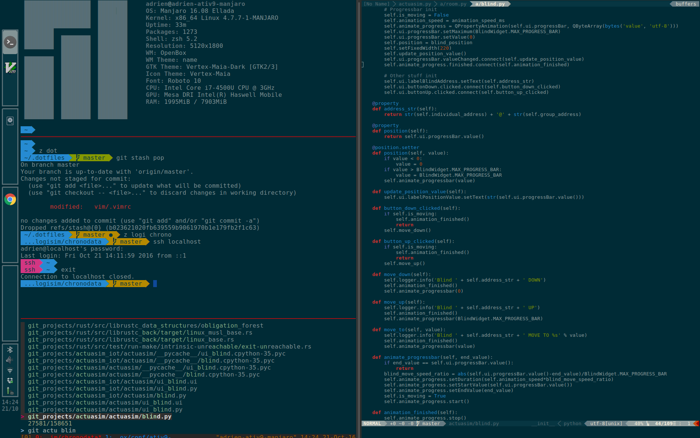

### My openbox configuration files

```
   git clone git@github.com:leadrien/dotfiles.git ~/.dotfiles
   cd .dotfiles
   ./configure.sh single|multi
```

##### Solarized colors, tint2 panel, zsh, tmux




#### To install from manjaro net install:

```
base-devel
openbox
oblogout obconf obmenu openbox-themes
ruby
xfce4-terminal
xfce4-notifyd
tmux
git
tint2

zsh
zsh-completions
oh-my-zsh

wmctrl compton nitrogen
thunar thunar-volman
dmenu-manjaro
network-manager-applet
gvfs
pyxdg

pulseaudio
pasystray

```

Set zsh as deflaut shell:
```
    chsh -s /usb/bin/zsh
```

